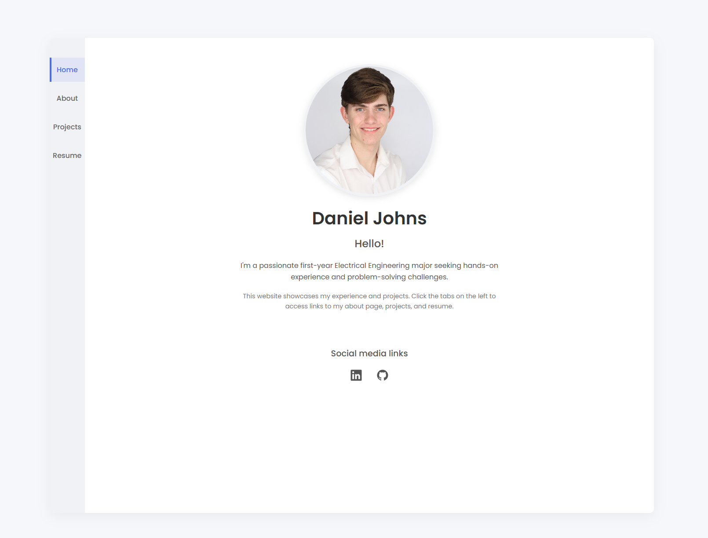

# Daniel Johns Portfolio Website

## Overview
This repository contains the source code for my personal portfolio website, showcasing my experience, skills, and projects as an Electrical Engineering student at Georgia Tech.

## Live Website
The website is hosted on GitHub Pages at: [https://djohns-droid.github.io/Daniel-Johns-Portfolio/index.html](https://djohns-droid.github.io/Daniel-Johns-Portfolio/index.html)

## Website Preview

## Features
- Clean, responsive design
- Information about my academic background and technical skills
- Overview of work experience and extracurricular activities
- Downloadable resume
- Links to social media and professional profiles

## Technologies Used
- HTML5
- CSS3
- JavaScript
- C++
- GitHub Pages for hosting

## Pages
- **Home**: Introduction and social media links
- **About**: Details about my education, skills, and experience
- **Projects**: Showcase of my engineering and programming projects
- **Resume**: Viewable and downloadable version of my resume

## Development
This website was developed as part of my personal branding effort to establish an online presence as I pursue opportunities in Electrical Engineering with a focus on Circuit Technology and Robotics.

## Contact
Feel free to reach out to me via:
- LinkedIn: [https://www.linkedin.com/in/daniel-johnsgt/](https://www.linkedin.com/in/daniel-johnsgt/)
- GitHub: [https://github.com/DJohns-droid](https://github.com/DJohns-droid)

